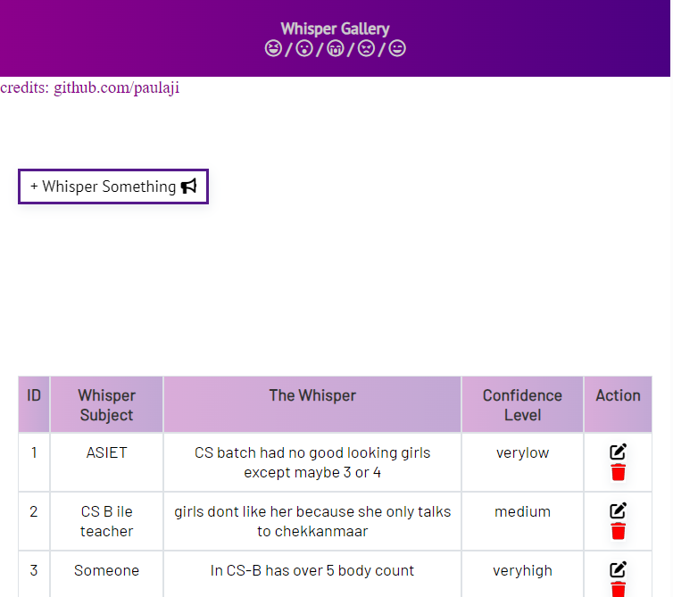
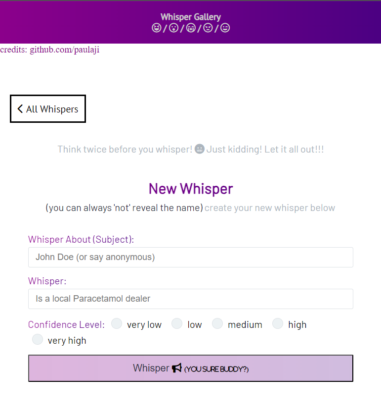
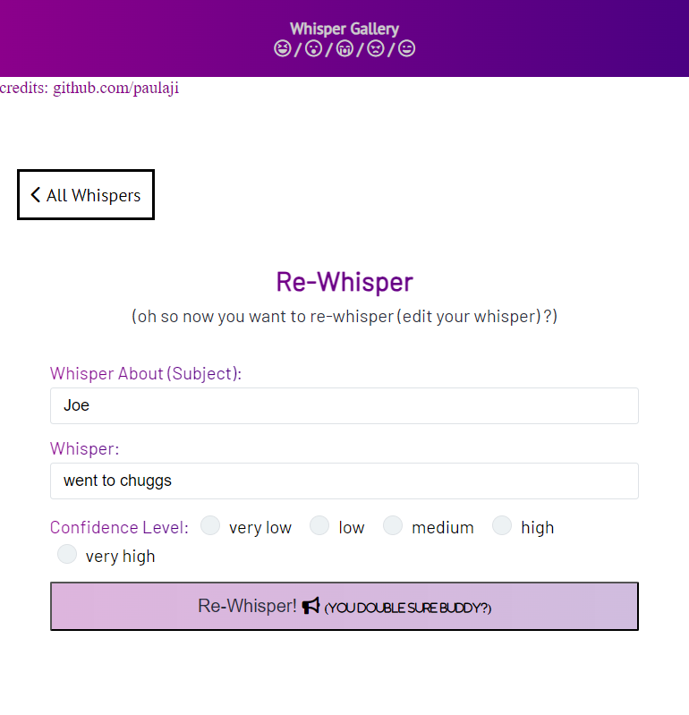

**Whisper Galley - Anonymous Rumor Sharing Platform**

Whisper Galley is an anonymous rumor sharing platform that allows users to post and read rumors without revealing their identities. With the use of modern web technologies, Whisper Galley ensures a secure and private environment for users to share their rumors.

## Features

- **Anonymous Posting:** Users can post rumors without providing any personal information, ensuring complete anonymity.

- **Read Rumors:** Users can browse through a collection of rumors posted by others anonymously.

- **Whispers:** Rumors are referred to as "Whispers," adding a sense of secrecy to the platform.

- **Re-Whispers:** Uh-oh! Want to edit a whisper? You can do that too!.

- **User Interaction:** Users can react to and comment on whispers without the need to sign up.

## Technologies Used

- Node.js
- Express.js
- MongoDB (using Mongoose)
- Axios
- EJS (Embedded JavaScript)
- Body-parser
- Morgan
- Dotenv
- Nodemon (for development)

## Deployment

Whisper Galley is deployed on [Render](https://render.com), a robust and scalable cloud platform that ensures the platform is readily accessible to users.

## Contributing

Contributions to Whisper Galley are welcome! If you find any issues or have suggestions for improvements, please feel free to open an issue or submit a pull request.

## License

Whisper Galley is released under the [MIT License](https://opensource.org/licenses/MIT).

---

**Note:** This README.md is a basic outline of the Whisper Galley project. Make sure to customize it further as you develop the project, including detailed instructions, setup, and other relevant information.
